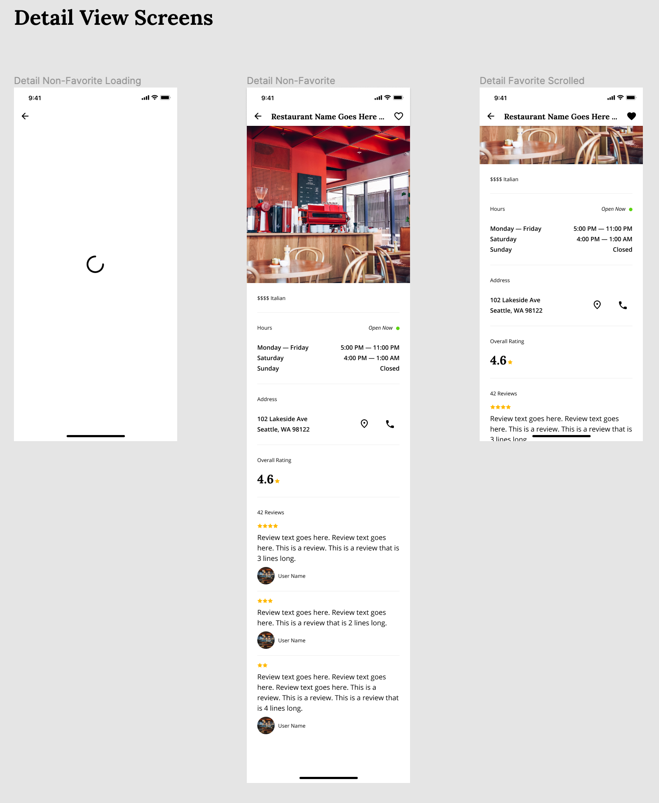

# RestauranTour

Be sure to read **all** of this document carefully, and follow the guidelines within.

## Vendorized Flutter

We are on a fixed Flutter release, similar to how gradle does this with a wrapper. More information on the approach can be found here:

> https://github.com/passsy/flutter_wrapper

_Be sure to use the `flutterw` wrapper while working on this repo._

From the root directory:

- `./flutterw pub get` to get the current packages for the specified flutter version.
- `./flutterw run -d {device_id}` to run the app.

### IDE Setup

<details>
<summary>Use with VSCode</summary>
<p>

If you're a VScode user link the new Flutter SDK path in your settings
`$projectRoot/.vscode/settings.json` (create if it doesn't exist yet)

```json
{
  "dart.flutterSdkPath": ".flutter"
}
```

Commit this file to your git repo and your coworkers will automatically use `flutterw` from now on

</p>
</details>

<details>
<summary>Use with IntelliJ / Android Studio</summary>
<p>

Go to `Preferences > Languages & Frameworks > Flutter` and set the Flutter SDK path to `$projectRoot/.flutter`


</p>
</details>

## Requirements

### App Structure

#### Restaurant List Page

- Tab Bar
  - List of favorites (stored client side)
  - List of businesses
    - Hero image
    - Name
    - Price
    - Category
    - Rating (rounded to the nearest value)
    - Open/Closed

#### Restaurant Detail View

- Ability to favorite a business
- Name
- Hero image
- Price and category
- Address
- Rating
- Total reviews
- List of reviews
  - User name
  - Rating
  - User image
  - Review Text (These are just snippets of the full review, usually like 3-4 lines long)

#### Misc.

- Clear documentation on the structure and architecture of your application.
- Clear and logical commit messages.
  - We suggest following [Conventional Commits](https://www.conventionalcommits.org/en/v1.0.0/)

## Test Coverage

To demonstrate your experience writing different types of tests in Flutter please do the following:

- Choose ONE portion of your state management and write a unit test.
- Choose ONE widget and write a widget test.

Feel free to add more tests as you see fit but the above is the minimum requirement.

## Design

- See this [Figma File](https://www.figma.com/file/KsEhQUp66m9yeVkvQ0hSZm/Flutter-Test?node-id=0%3A1) for design information related to the overall look and feel of the application. We do not expect pixel-perfection but would like an end product that is very similar to what is specified in the Figma file.




## API

The [Yelp GraphQL API](https://www.yelp.com/developers/graphql/guides/intro) is used as the API for this Application. We have provided the boilerplate of the API requests and backing data models to save you some time. To successfully make a request to the Yelp GraphQL API, please follow these steps:

1. Please go to https://www.yelp.com/signup and sign up for a developer account.
1. Once signed up, navigate to https://www.yelp.com/developers/v3/manage_app.
1. Create a new app by filling out the required information.
1. Once your app is created, scroll down and join the `Developer Beta`. This allows you to use the GraphQL API.
1. Copy your API Key from your app page and paste it on `line 5` [yelp_repository.dart](app/lib/yelp_repository.dart) replacing the `<PUT YOUR API KEY HERE>` with your key.
1. Run the app and tap the `Fetch Restaurants` button. If you see a log like `Fetched x restaurants` you are all set!

## Technical Requirements

### State Management

Please restrict your usage of state management or dependency injection to the following options:

1. [provider](https://pub.dev/packages/provider)
2. [Riverpod](https://pub.dev/packages/riverpod)
3. [bloc](https://pub.dev/packages/bloc)
4. [get_it](https://pub.dev/packages/get_it)/[get_it_mixins](https://pub.dev/packages/get_it_mixin)
5. [Mobx](https://pub.dev/packages/mobx)

We ask this because this challenge values consistency and efficiency over ingenuity. Using commonly used libraries ensures that we can review your code in a timely manner and allows us to provide better feedback.

## Coding Values

At **Superformula** we strive to build applications that have

- Consistent architecture
- Extensible, clean code
- Solid testing
- Good security & performance best practices

### Clear, consistent architecture

Approach your submission as if it were a real world app. This includes Use any libraries that you would normally choose.

_Please note: we're interested in your code & the way you solve the problem, not how well you can use a particular library or feature._

### Easy to understand

Writing boring code that is easy to follow is essential at **Superformula**.

We're interested in your method and how you approach the problem just as much as we're interested in the end result.

### Solid testing approach

While the purpose of this challenge is not to gauge whether you can achieve 100% test coverage, we do seek to evaluate whether you know how & what to test.

## Q&A

> Where should I send back the result when I'm done?

Please fork this repo and then send us a pull request to our repo when you think you are done. There is no deadline for this task unless otherwise noted to you directly.

> What if I have a question?

Just create a new issue in this repo and we will respond and get back to you quickly.

## Review

The coding challenge is a take-home test upon which we'll be conducting a thorough code review once complete. The review will consist of meeting some more of our mobile engineers and giving a review of the solution you have designed. Please be prepared to share your screen and run/demo the application to the group. During this process, the engineers will be asking questions.
